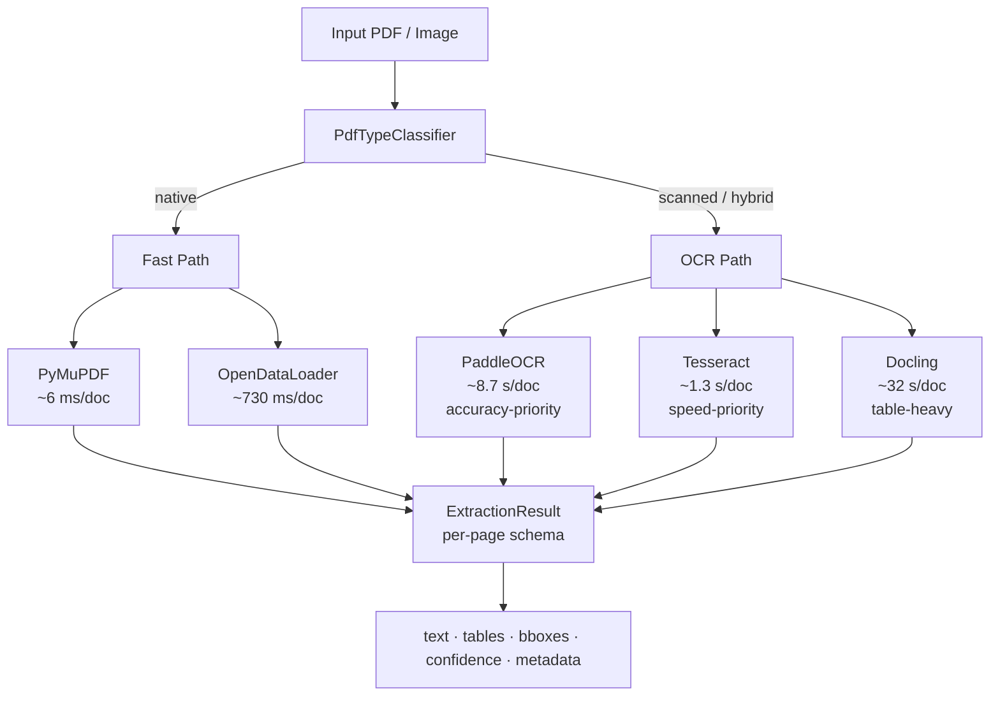

# PDF Extraction Tool Evaluation & Benchmarking

Benchmarking toolkit for evaluating open-source PDF extraction and OCR tools as
alternatives to AWS Textract. Includes a Streamlit UI, benchmark pipelines
(RVL-CDIP, FUNSD), and five production-ready extractor adapters.

## Architecture



**Key design decisions:**
- Classify first, extract second — avoids applying OCR to native PDFs (saves
  10–100× latency).
- Shared `ExtractionResult` schema across all extractors — downstream code is
  extractor-agnostic.
- All five extractors implement `BaseExtractor`; swapping tools requires no
  changes to application logic.

See [`docs/integration_guide.md`](docs/integration_guide.md) for programmatic
usage and microservice embedding examples.

## Runtime Requirements

- Python 3.11+
- Java 11+ on system PATH (required by OpenDataLoader)
- Tesseract OCR binary on system PATH (required by the Tesseract extractor)

Verify Java:

```bash
java -version
```

If Java is missing on Windows, install Eclipse Temurin JDK 11+ and reopen terminal.

Verify Tesseract:

```bash
tesseract --version
```

If Tesseract is missing:

- **Windows**: `winget install --id UB-Mannheim.TesseractOCR -e`, then reopen
  your terminal. The Tesseract extractor also falls back to
  `C:\Program Files\Tesseract-OCR\tesseract.exe` if the binary is installed
  but not yet on PATH.
- **macOS**: `brew install tesseract`
- **Linux (Debian/Ubuntu)**: `sudo apt-get install tesseract-ocr`

## Setup

```bash
python -m venv .venv
.venv\\Scripts\\activate
pip install --upgrade pip
pip install -e .[dev]
pip install -r requirements.txt
```

## Run Streamlit UI

```bash
streamlit run src/pdf_extraction_benchmark/ui/app.py
```

## Run OpenDataLoader Demo Script

```bash
python scripts/run_opendataloader_demo.py data/raw/native/native_research_01.pdf
```

## Major directories

- `config/`: Tool configs, benchmark configs, dataset paths, environment placeholders.
- `data/`: Raw PDFs, processed outputs, and ground-truth references.
- `src/pdf_extraction_benchmark/`: Main package with modular architecture.
- `tests/`: Starter tests for extractors, benchmark pipeline, parser outputs.
- `outputs/`: JSON/Markdown/charts/logs/benchmark results.
- `scripts/`: Runnable benchmark and extraction scripts.

## Dataset Strategy (Native vs Scanned)

The dataset is intentionally organized around extraction strategy, not early document subcategories:

- `data/raw/native/`: text-based PDFs suited for direct parsing/extraction.
- `data/raw/scanned/`: image-based PDFs requiring OCR-oriented extractors.

Why this matters:

- Native PDFs → direct extraction tools (OpenDataLoader, PyMuPDF)
- Scanned PDFs → OCR-based extractors (PaddleOCR, Tesseract, Docling)

This keeps routing and benchmarking aligned with real-world document AI pipelines.

### OpenDataLoader extraction modes

OpenDataLoader operates in two modes depending on document type:

- **Native PDFs**: OpenDataLoader's standard (Java, text-layer) extraction pipeline.
- **Scanned/Image PDFs**: OpenDataLoader Hybrid Mode, which delegates OCR and layout
  analysis to a Docling-based backend (`docling-fast`) running with `rapidocr`.

Because of this, benchmark results for OpenDataLoader on scanned/image documents
reflect the Docling+rapidocr hybrid backend's accuracy and speed (including its
startup/inference cost), not an independent OCR engine. Native-PDF results are
unaffected and use OpenDataLoader's own pipeline.

### Extractors

- **OpenDataLoader**: Java-based extractor with a native (text-layer) pipeline
  and a Docling/rapidocr-backed Hybrid OCR mode (see above).
- **PyMuPDF**: fast text-layer extraction for native PDFs; no OCR support.
- **Docling**: layout-aware extraction with markdown and table support; runs
  OCR for scanned content.
- **PaddleOCR**: OCR-based extractor for scanned PDFs and images, with
  word-level bounding boxes and confidences. Supports English and
  multilingual (Hindi/Marathi/Devanagari) modes.
- **Tesseract**: OCR-based extractor for scanned PDFs and images using
  `pytesseract` and a local Tesseract OCR install. Returns word-level text,
  bounding boxes, and confidences via `image_to_data`. Requires the
  `tesseract` binary to be installed and discoverable (see Runtime
  Requirements above).

Tools assessed but not implemented: see [`docs/rejected_tools.md`](docs/rejected_tools.md)
for the full justification for Marker, Surya OCR, Unstructured.io, and Textract.

## Key Documents

| Document | Location |
| --- | --- |
| Tool comparison matrix (1–10 scores per criterion) | [`docs/comparison_matrix.md`](docs/comparison_matrix.md) |
| Cost analysis vs AWS Textract | [`docs/cost_analysis.md`](docs/cost_analysis.md) |
| Integration guide (microservice embedding) | [`docs/integration_guide.md`](docs/integration_guide.md) |
| Rejected / deferred tools | [`docs/rejected_tools.md`](docs/rejected_tools.md) |
| Benchmark findings summary | [`docs/benchmark_findings.md`](docs/benchmark_findings.md) |
| Tesseract vs PaddleOCR vs Docling evaluation | [`outputs/benchmark_results/tesseract_evaluation/tesseract_evaluation_report.md`](outputs/benchmark_results/tesseract_evaluation/tesseract_evaluation_report.md) |
| PAN card qualitative OCR benchmark (identity-document images) | [`outputs/benchmark_results/pan_card_qualitative/final_report.md`](outputs/benchmark_results/pan_card_qualitative/final_report.md) |

> **Note:** The PAN benchmark report, manifest, and 20 annotated sample images
> are committed and fully reproducible from this repo. The underlying raw
> dataset (~1,400 images, `data/PAN.v2i.yolov8/train/` + `valid/`) is excluded
> from git for size; re-download it from Roboflow if you need to re-run
> [`scripts/run_pan_qualitative_benchmark.py`](scripts/run_pan_qualitative_benchmark.py)
> from scratch — `data/PAN.v2i.yolov8/pan_sample_manifest.csv` and `data.yaml`
> are kept so the exact 20-image selection can be re-matched against a
> re-downloaded copy.

## Known Limitations

- **Handwriting:** None of the five evaluated tools handle handwritten text
  reliably. All produce garbled output on the FUNSD handwritten category and the
  RVL-CDIP handwritten category. Handwritten documents should continue to use
  AWS Textract or a dedicated HWR model until a viable open-source alternative
  is identified.

- **FUNSD CER/WER interpretation:** CER of 0.443 (PaddleOCR, best result) on
  FUNSD reflects extraction on low-resolution, noisy scanned forms without any
  post-processing. Production documents are typically higher quality; with spell
  correction and NLP post-processing, usable accuracy is higher. FUNSD numbers
  establish relative ranking across tools, not absolute production accuracy.
  An earlier 5-doc Docling sample showed CER 0.417; the full 50-doc run (CER 0.500)
  corrected this — Docling is the weakest on text accuracy but strongest on structure.

- **Docling latency variance:** Docling's worst-case latency was 207 seconds on
  a single complex specification document. Mean latency is 32 seconds per
  document. It is unsuitable for real-time or high-throughput pipelines without
  a per-document timeout and pre-classification guard.

- **PaddleOCR on native PDFs:** PaddleOCR applies OCR regardless of whether the
  PDF has a text layer. On a 26-page native document it took 262 seconds.
  Always classify documents before routing to PaddleOCR.

- **Tesseract word-count inflation:** Tesseract extracts more words than
  PaddleOCR on most RVL-CDIP documents, but has a higher character error rate
  (CER 0.48 vs 0.44 on FUNSD). The extra words are partly noise — confirmed
  by qualitative review on handwritten documents. Higher word count alone is not
  evidence of higher accuracy.

- **Unstructured.io not evaluated:** A dependency conflict (`numpy<2` required
  by PaddleOCR 2.6.2 vs `numpy>=2` required by unstructured ≥0.17) prevented
  installation in the shared environment. See
  [`docs/rejected_tools.md`](docs/rejected_tools.md).

- **Table extraction tested on RVL-CDIP only:** Ground-truth table comparisons
  (row/column accuracy) are not available for the RVL-CDIP dataset. Docling's
  table output was verified qualitatively; no CER-equivalent metric for tables
  was computed.

## Benchmark Results Summary

| Tool | Type | FUNSD CER ↓ | RVL-CDIP Latency | Tables |
|---|---|---|---|---|
| PyMuPDF | Native | n/a (text layer) | 6 ms/doc | No |
| OpenDataLoader | Native + Hybrid | n/a (text layer) | 730 ms/doc | Yes |
| PaddleOCR | OCR | **0.443** (50 docs) | 8,735 ms/doc | No |
| Tesseract | OCR | 0.485 (50 docs) | **1,265 ms/doc** | No |
| Docling | OCR + Layout | 0.500 (50 docs) | 32,295 ms/doc | **Yes** |

Lower CER is better. Latency from RVL-CDIP benchmark (32 single-page documents).
Full methodology and per-criterion scores: [`docs/comparison_matrix.md`](docs/comparison_matrix.md).
